<div align="center">

# 🎙️ AI 同声传译助手

**AI Real-time Interpretation Assistant** — 实时将外语音频流翻译为中文，带字幕与智能修正能力。

</div>

<p align="center">
  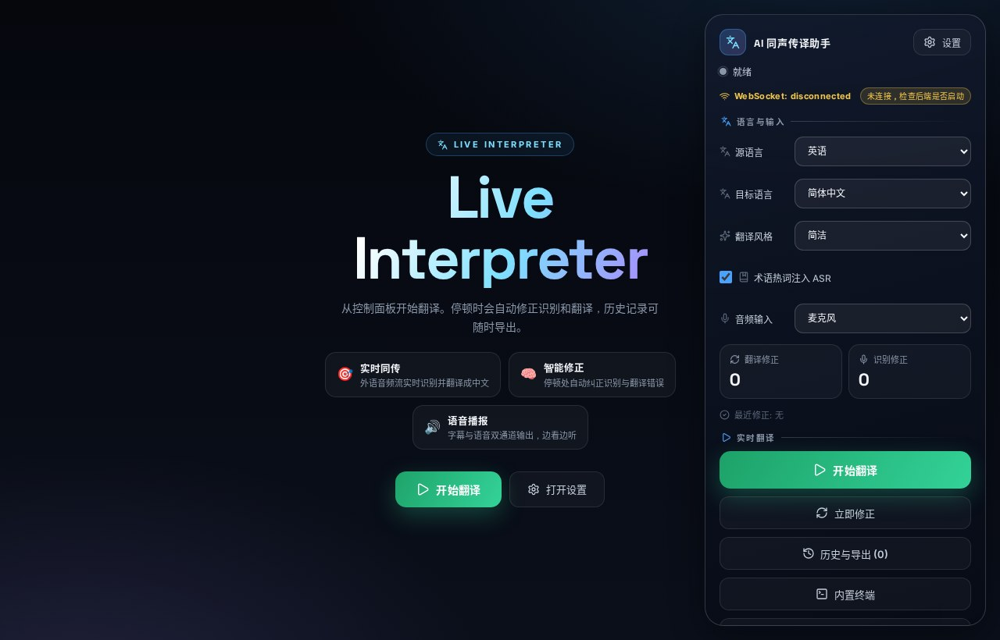
</p>

---

## ✨ UI 一览（实机截图）

> 以下均为 **真实运行界面截图**，中文正常渲染，控制面板分组清晰、连接状态一目了然。

### 主界面 · 空状态引导

未开始翻译时，主界面居中展示产品定位与三步功能亮点（实时同传 / 智能修正 / 语音播报），并直接提供「开始翻译」入口；右侧玻璃面板则清晰划分 **语言与输入**、**实时翻译** 两个功能区。


### 功能面板

每个面板都以独立悬浮窗口呈现，风格统一、信息完整，中文全部可读。

| 设置面板 · 本地配置 | 字幕历史 · 多格式导出 |
|:---:|:---:|
| 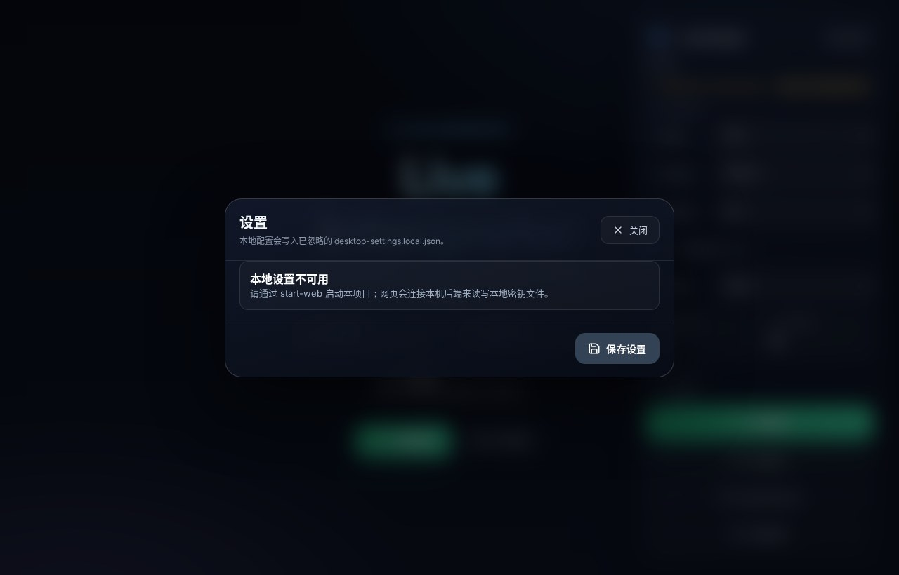 | 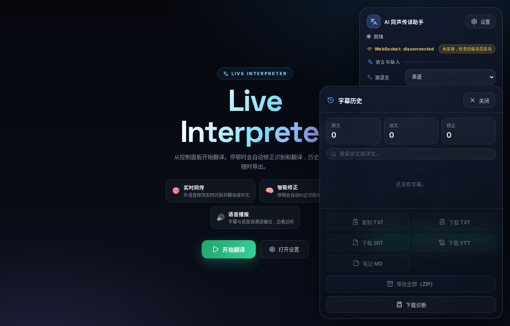 |
| API Key / 引擎 / 模型 / ASR 统一管理，保存提示清晰 | 历史回放 + TXT/SRT/VTT/MD/ZIP 一键导出 |

| 内置终端 · 后端操作台 | 学习摘要 · 智能总结 |
|:---:|:---:|
| 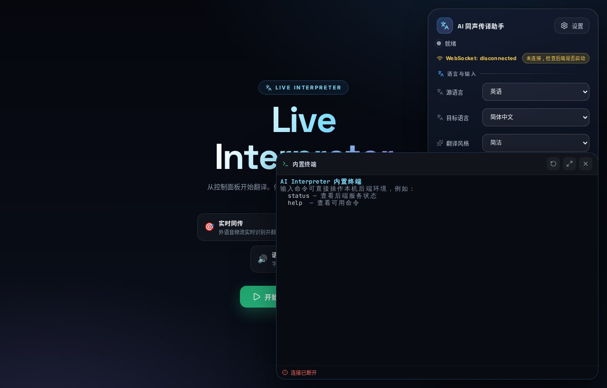 | 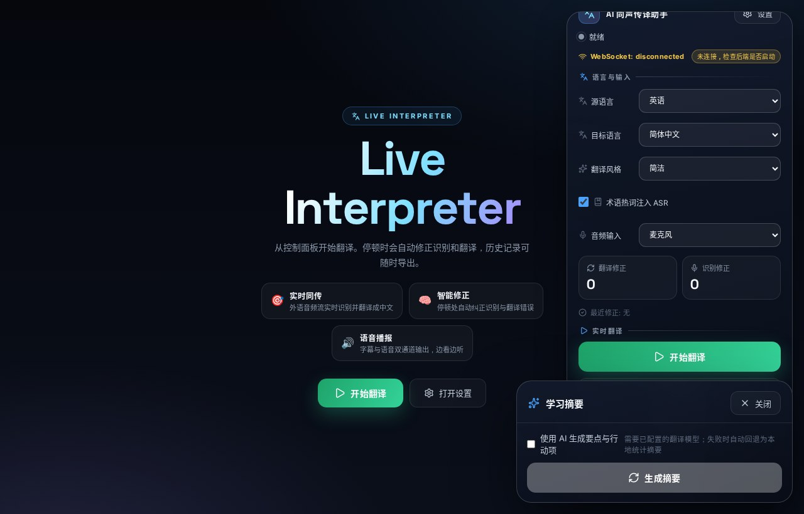 |
| 内嵌 xterm 终端，欢迎横幅 + 连接状态一目了然 | 本地统计 + LLM 增强双模式生成摘要 |

| 术语库 · 热词注入 | 翻译记忆库 · 越用越准 |
|:---:|:---:|
| 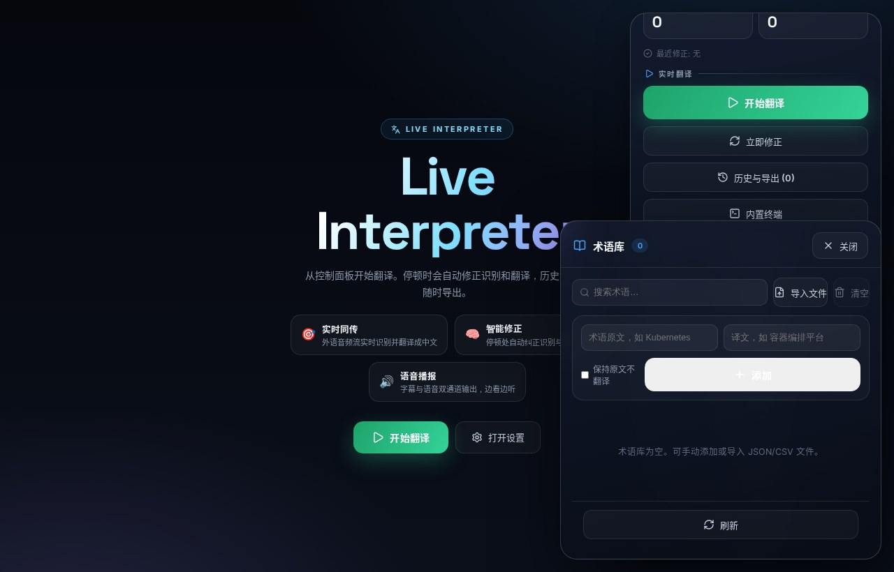 | 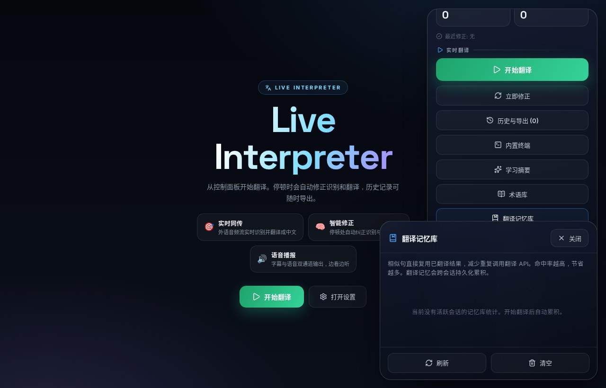 |
| 术语 CSV/JSON 导入，ASR + NMT 双通道生效 | 跨会话持久化记忆，LCS + Jaccard 检索 |

| 字幕样式 · 实时预览 | 协作翻译 · 多人房间 |
|:---:|:---:|
| 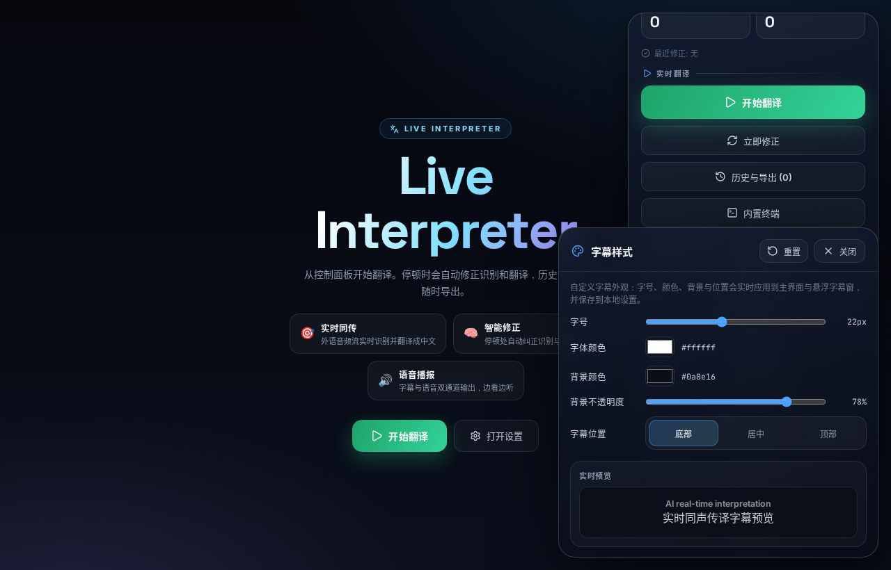 | 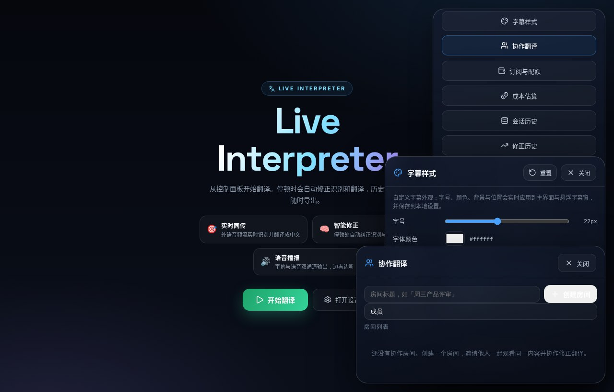 |
| 字号 / 颜色 / 位置 CSS 变量驱动 | 房间式协作，修正实时全员可见 |

| 订阅与配额 · 用量管控 | 成本估算 · 实时计量 |
|:---:|:---:|
| 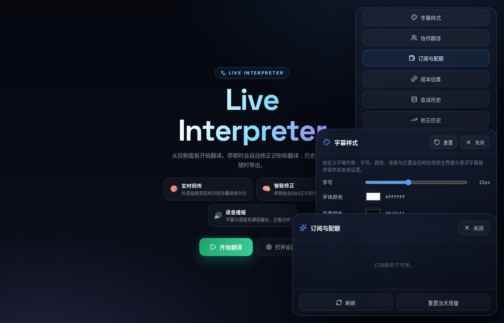 | 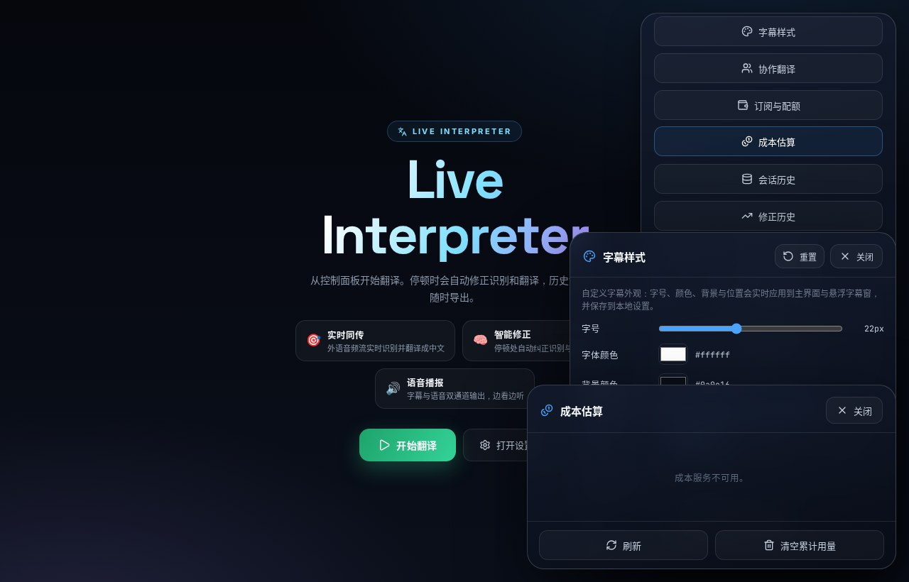 |
| 4 档套餐 + 每日句数计量 | token / 音频 / 字符成本实时可视化 |

| 会话历史 · 隐私管理 | 修正历史 · 时间线 |
|:---:|:---:|
| 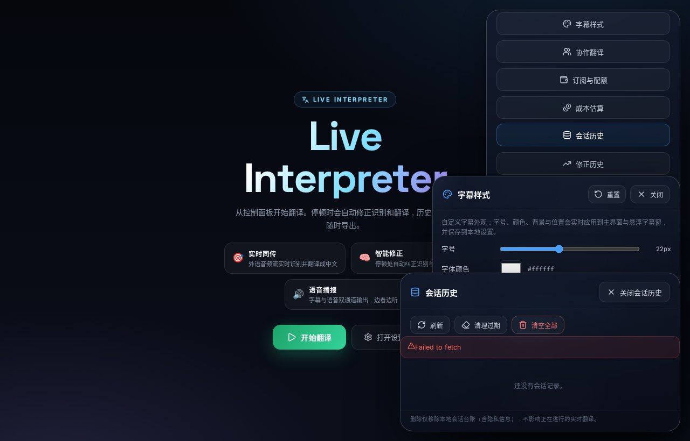 | 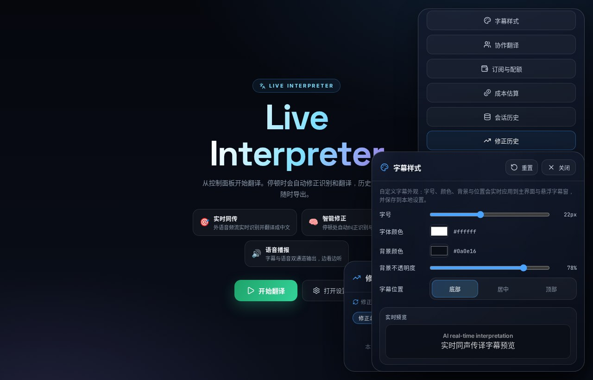 |
| 会话质量指标落盘 + TTL 自动清理 | 修正类型 / 来源 / 耗时可视化 |

---

### 🛠️ 本次 UI 体验升级

- **中文字体修复**：内嵌 Noto Sans SC 子集字体，彻底解决「豆腐块」缺字问题，任何系统下中文均正常显示
- **连接状态警示**：WebSocket 断开时以琥珀色高亮 + 提示文案，异常一目了然
- **信息层级分组**：控制面板按「语言与输入」「实时翻译」分区，告别按钮堆叠
- **空状态引导**：主界面展示功能亮点与「开始翻译」入口，新用户上手零门槛
- **视觉一致性**：统一面板圆角 / 边框对比度 / 分割线，深色模式更清晰

## 项目简介

AI 同声传译助手是一款 **实时将单向外语音频流翻译为中文** 的应用，支持 **字幕展示 + 语音播报** 双通道输出。通过 AI 能力帮助用户观看英文演讲、技术分享、国际会议或网课时 **降低语言门槛、提升信息获取效率**。

系统具备**智能修正能力**，能够自动纠正此前识别或翻译的错误，实现"越用越准"的同传体验。

---

## 核心特性

- 🎯 **实时同声传译**：WebSocket 实时音频流 → ASR 识别 → 翻译 → 字幕/语音输出
- 🧠 **智能修正引擎**：基于置信度、停顿检测、句数规则自动触发修正，也可手动修正
- 📚 **多语种支持**：源语言自动检测 + 7 种目标语言（中/英/日/韩/西/法/德）
- 🔊 **流式 TTS 语音播报**：edge-tts / OpenAI 引擎合成，修正时智能播报
- 📂 **多音频源**：麦克风 / 标签页 / 系统音频 (Tauri) / 音频文件 四种输入
- 🗂️ **术语库管理**：热词注入 ASR + 翻译约束双通道生效
- 📖 **翻译记忆库**：跨会话持久化，越用越准、越用越省
- 🤝 **多人协作翻译**：房间式协作，提交修正全员可见
- 📊 **成本估算与订阅配额**：实时计量与用量控制
- 🖥️ **多端覆盖**：Web / Electron 桌面 / Tauri 原生 / PWA 离线

---

## 快速开始

### Web 模式（推荐）

**Windows 一键启动：** 双击项目根目录的 `start-web.cmd`

启动流程：
1. 构建 Vite 前端（需要时）
2. 启动本地静态服务器
3. 启动 FastAPI 后端（若端口未被占用）
4. 自动打开浏览器访问应用
5. 通过界面「设置」配置 API Key，无需手动编辑文件

**默认配置：**

```text
ASR_ENGINE=openai
ASR_OPENAI_MODEL=whisper-1
ASR_OPENAI_BASE_URL=https://api.openai.com/v1
ASR_OPENAI_API_KEY=<your-transcription-api-key>
```

可通过界面「设置」配置翻译引擎/ASR模型/API Key，无需手动编辑配置文件。配置保存到 `config/desktop-settings.local.json`（被 Git 忽略）。

### 桌面模式（Electron）

**Windows：** 双击 `start-desktop.cmd` 启动 Electron 桌面端，支持透明悬浮字幕窗（always-on-top）。

- 单实例 + 托盘 + 最小化到托盘
- 悬浮字幕窗在其他应用之上显示
- 设置面板持久化配置

### Tauri 桌面端

双击 `start-tauri.cmd` 或运行：

```bash
python tools/desktop_launcher.py --build --mode tauri
```

安装包约 **10-20MB**，远小于 Electron。支持托盘、单实例、透明悬浮字幕窗、实验性系统音频采集（`--features system-audio`）。

### 音频源选择

| 音频源 | 说明 |
|--------|------|
| 🎤 **麦克风** | `getUserMedia` 采集，带回声消除/降噪/自动增益 |
| 📺 **标签页/窗口** | `getDisplayMedia` 共享屏幕时勾选分享音频 |
| 💻 **系统音频 (Tauri)** | loopback 采集（需 `--features system-audio` 构建） |
| 📁 **音频文件** | WAV/MP3/OGG/FLAC 本地文件，按实时节奏逐句翻译 |

---

## 翻译管线

```
┌─────────┐    ┌─────────┐    ┌─────────┐    ┌─────────┐    ┌─────────┐
│ 音频采集 │ → │   VAD   │ → │   ASR   │ → │   NMT   │ → │ 字幕/TTS │
│ 四源输入 │    │ 句子切分 │    │ 语音识别 │    │ 翻译引擎 │    │ 双通道输出 │
└─────────┘    └─────────┘    └─────────┘    └─────────┘    └─────────┘
                                     ↓              ↓
                              ┌─────────┐    ┌─────────┐
                              │ 修正引擎 │    │ 术语库  │
                              │ 智能修正 │    │ 记忆库  │
                              └─────────┘    └─────────┘
```

### 关键设计

- **ASR 回调不阻塞翻译**：翻译与修正后台异步化，带并发信号量、优雅停关与乱序保护
- **上下文窗口分层**：近 3 句原文 + 更早句压缩，input token 预估降 **60%**
- **自适应 VAD 切分**：Silero VAD + 时长约束，不切碎句子
- **智能降级**：NMT 失败指数退避重试，最终降级为原文透传保证字幕不断流
- **音频采集静音丢弃**：RMS 阈值，节省 **30-40%** 带宽与 ASR 调用

---

## 功能全景

| 模块 | 状态 | 说明 |
|------|:---:|------|
| 实时音频采集 | ✅ | AudioWorklet + ScriptProcessor 双通道 |
| 实时翻译管线 | ✅ | 流式 ASR → 翻译 → 字幕 |
| 智能修正引擎 | ✅ | 置信度/停顿/句数规则 + 手动修正 |
| 双语字幕 | ✅ | 原文+译文双语展示，虚拟滚动 |
| 流式 TTS | ✅ | 边翻译边合成，修正智能播报 |
| 说话人分离 | ✅ | 按段标注，前端着色（默认关闭） |
| 翻译记忆库 | ✅ | 跨会话持久化，LCS+Jaccard 索引 |
| 术语库管理 | ✅ | ASR 热词注入 + NMT 约束双通道 |
| 多人协作翻译 | ✅ | 房间式实时协作修正 |
| 会话历史管理 | ✅ | 质量指标落盘，TTL 自动清理 |
| 订阅与配额 | ✅ | 4 档套餐 + 每日句数计量 |
| 成本估算 | ✅ | 实时计量 token/音频/字符成本 |
| 学习摘要 | ✅ | 本地统计 + LLM 增强双模式 |
| 字幕样式配置 | ✅ | 字号/颜色/位置 CSS 变量驱动 |
| 离线 PWA | ✅ | Service Worker 壳缓存 + 离线兜底 |
| 内置终端 | ✅ | xterm.js + WebSocket PTY 桥接 |
| 全局快捷键 | ✅ | Ctrl+Space / Ctrl+1 / Ctrl+H |
| 会话导出 | ✅ | SRT/VTT/TXT/MD/ZIP 多格式 |
| 数字/专名稳定 | ✅ | ASR 规范化 + NMT 提示词规则 |
| 修正历史时间线 | ✅ | 类型/来源/触发方式/耗时可视化 |
| 字幕搜索与高亮 | ✅ | 大小写不敏感 + 关键词高亮 |
| 翻译风格控制 | ✅ | 简洁 / 忠实 / 讲义式 |

---

## 技术架构

### 前端 (React + Vite + TypeScript)

- **UI 设计**：Awwwards 级深空黑 + 极光渐变设计系统，弹簧动效、玻璃拟态面板
- **图标**：统一使用 **Lucide**，界面零 emoji
- **状态管理**：Zustand + SubtitleStore 单向数据流
- **性能**：所有面板 React.lazy 按需加载，首屏 JS 减少约 10%；Vite 手动分包
- **桌面适配**：Electron / Tauri v2 双路线，支持透明悬浮字幕窗
- **PWA 离线**：Service Worker 壳缓存 + 运行时缓存 + 离线兜底

### 后端 (Python + FastAPI)

- **ASR 引擎**：faster-whisper（本地）/ OpenAI 兼容（whisper-1 等）
- **翻译引擎**：OpenAI / Claude 兼容 chat completions 接口
- **TTS 引擎**：edge-tts（免费）/ OpenAI 兼容
- **会话存储**：本地 JSON 持久化 + Redis（可选）
- **安全**：默认仅监听 `127.0.0.1`、CORS 白名单、WebSocket Origin 校验、强会话 ID（192-bit 随机）、重连令牌

### 质量保障

| 指标 | 数据 |
|------|------|
| 后端单元测试 | **376** 通过 + 1 跳过 |
| 前端单元测试 | **208** 通过 |
| E2E 端到端测试 | **7** 条关键用户流程 (Playwright) |
| CI 矩阵 | Python 3.10 / 3.11 / 3.12 |
| 依赖安全审计 | npm audit + pip-audit（high/critical 阻断） |
| 质量回归 | BLEU + WER/CER 自动对比基线 |
| 静态检查 | ruff + tsc 全绿 |
| 30 分钟耐力跑 | 接收比 100%、0 丢弃/重连/乱序 |

---

## 项目结构

```
├── frontend/           # React + Vite + TypeScript 前端
│   ├── src/
│   │   ├── audio/      # 音频采集与播放（AudioSourceManager）
│   │   ├── subtitle/   # 字幕渲染/存储/导出/搜索/样式
│   │   ├── network/    # WebSocket 客户端
│   │   ├── ui/         # 控制面板/设置面板/各功能面板
│   │   ├── desktop/    # Electron/Tauri 桌面适配
│   │   └── export/     # 会话产物导出 (ZIP/SRT/VTT/MD)
│   └── src-tauri/      # Tauri Rust 侧工程
├── backend/            # Python FastAPI 后端
│   ├── api/            # REST/WebSocket 端点
│   ├── services/       # 核心业务服务（ASR/NMT/TTS/修正等）
│   ├── core/           # 配置与工具
│   └── models/         # 数据模型
├── docs/               # 文档与截图
├── tests/              # 测试与夹具（含音频 fixture）
├── tools/              # 工具脚本（启动/验证/评测）
└── config/             # 配置文件模板
```

---

## 相关文档

- [部署指南](docs/DEPLOYMENT.md) — 环境准备、配置、部署形态、安全基线、成本控制
- [Tauri 桌面端](docs/TAURI_DESKTOP.md) — Tauri 构建/运行指南
- [性能基线](docs/PERFORMANCE_BASELINE.md) — 耐力跑测试结果与性能指标
- [隐私说明](PRIVACY.md) — 数据类别、去向与本地化建议

---

## 开发与贡献

### 本地开发

```bash
# 前端
cd frontend
npm install
npm run dev

# 后端
cd backend
pip install -r requirements.lock.txt
uvicorn main:app --reload --host 127.0.0.1 --port 8000
```

### 验证

```bash
# 前端测试
cd frontend && npm test

# 后端测试
cd backend && python -m unittest discover backend

# E2E 测试
cd frontend && npm run e2e

# 质量回归
python tools/quality_regression.py

# 完整验证套件
python tools/interpreter_validation_suite.py --output reports/interpreter-validation-latest.json
```

### 提交规范

使用 [Conventional Commits](https://www.conventionalcommits.org/) 规范提交：
- `feat: 新增功能`
- `fix: 修复问题`
- `docs: 更新文档`
- `refactor: 重构代码`

---

<div align="center">

**MIT License** | 如有问题请提交 [Issue](https://github.com/nangongdao/competition2/issues)

</div>
